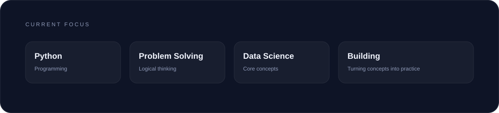
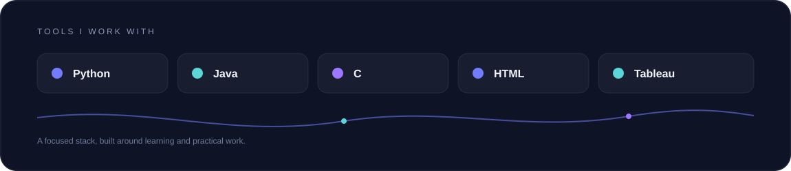

 

&nbsp;

&nbsp;

 

## About Me

I am currently pursuing BTech in Data Science, focused on building a strong
foundation in programming and analytical thinking.

I prefer clarity over speed and depth over surface-level knowledge.
My learning approach is steady, practical, and consistent.

 

 

## How I Learn

I enjoy learning by building, experimenting with ideas, and gradually
turning concepts into something practical.

I am still learning, still improving, and trying to understand things
properly rather than simply getting them to work.

 

 

## GitHub Activity

  

  

 

## Find Me Here

<a href="mailto:himaja625@gmail.com">Email</a>
&nbsp;&nbsp;•&nbsp;&nbsp;
<a href="https://www.linkedin.com/in/naga-himaja">LinkedIn</a>
&nbsp;&nbsp;•&nbsp;&nbsp;
<a href="https://naga-himaja-portfolio.onrender.com">Portfolio</a>

  

<i>Quiet work. Clear direction.</i>

