  

<a href="mailto:himaja625@gmail.com">Email</a>
&nbsp; · &nbsp;
<a href="https://github.com/Himaja625">GitHub</a>
&nbsp; · &nbsp;
<a href="https://www.linkedin.com/in/naga-himaja">LinkedIn</a>
&nbsp; · &nbsp;
<a href="https://naga-himaja-portfolio.onrender.com">Portfolio</a>

 

## A little about me

I'm a **Data Science student** who likes figuring out how things work, turning ideas into projects, and learning things properly instead of just collecting tutorials.

I usually have about five ideas in my head at once. Some become projects. Some become notes. Some are still waiting for their turn.

Right now, I'm mostly working with **Python, Data Science, Machine Learning, and problem-solving**, while slowly getting better at everything around them.

 

## What I'm into right now

`Python` &nbsp;&nbsp;
`Data Science` &nbsp;&nbsp;
`Machine Learning` &nbsp;&nbsp;
`Problem Solving`

 

I'm especially interested in the part between **"I have an idea"** and **"okay, it actually works."**

That usually means experimenting, building small things, breaking them, fixing them, and occasionally staring at an error for way too long.

 

---

## Things I've built

<b>HeatGuard</b> · understanding heat beyond a temperature number

 

A project built around temperature data, spatial insights, heat exposure, evidence, and practical interpretation.

The goal was to explore **where heat matters most, why it matters, and what someone could consider doing about it.**

 

<b>SoilSense</b> · AI-driven soil health analysis

 

A practical web project for analysing soil information, producing a score, and turning the result into understandable recommendations.

 

<b>SDSS Galaxy Classifier</b> · classifying galaxies with machine learning

 

A Flask-based machine-learning project using astronomical data to classify galaxies.

 

 

**These are just a few of the things I've worked on.**

There are more projects, experiments, and smaller builds scattered across my repositories.

<a href="https://github.com/Himaja625?tab=repositories">
  Explore all my repositories →
</a>

 

---

## My little corner of GitHub

&nbsp;&nbsp;&nbsp;

 

---

## What I'm learning

| | |
|---|---|
| **Python** | stronger fundamentals |
| **Data Science** | better analysis and intuition |
| **Machine Learning** | understanding models, not just calling them |
| **DSA** | building problem-solving skills steadily |

 

> No speedrun. I'd rather actually understand it.

 

---

## How I like to work

I like **clarity over unnecessary complexity**.

I learn better when I can **build something with what I just learned**.

I care about making technical things **understandable**, not just functional.

And I'm still learning. Quite a lot, actually. **That's kind of the point.**

 

---

### Still learning. Still building.

A little progress every day is still progress.

Quiet work. Clear direction.

